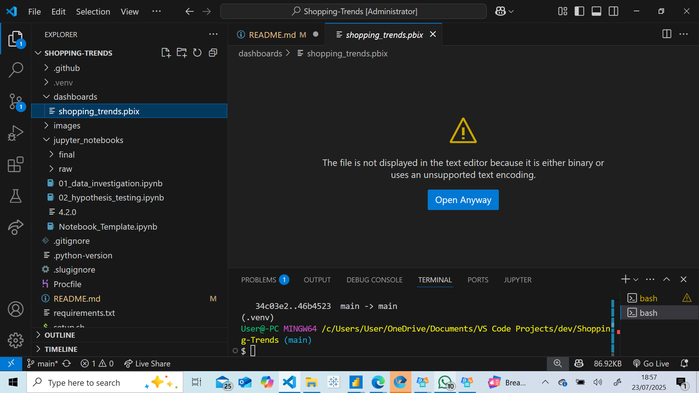

# **Shopping trends and customer behaviour analysis**
## *Celia Pires*

## **Project introduction**

* This dataset provides a detailed snapshot of online shopping behaviour and consumer trends. It contains synthetic yet realistic customer profiles with various features such as age, gender, purchase categories, payment preferences and engagement with promotional offers. 

* The dataset can be found in Kaggle: [dataset](https://www.kaggle.com/datasets/sahilislam007/shopping-trends-and-customer-behaviour-dataset). 

* License: (CC0) Public domain

## Dataset content

* 3900 rows
* 18 columns
* File type: csv

| **Column** | **Description** |
| --------------------------- | --------------------------------------------- |
| **Unnamed column** | Indexed column |
| **Customer ID** | Unique identified for each customer |
| **Age** | Age of the customer |
| **Gender** | Gender of the customer (Male / Female/Other) |
| **Item purchased** | Name of the item bought |
| **Category** | Category of the item (e.g., Clothing, Footwear) |
| **Purchase amount (USD)** | Total amount spent in USD |
| **Location** | Location where the purchase occurred |
| **Color** | Preferred color of the item |
| **Season** | Season in which the purchase was made |
| **Review rating** | Customer review score (scale: 1.0 to 5.0) |
| **Subscription status** | Whether the customer is subscribed to a membership plan (Yes/No) |
| **Shipping type** | Chosen method of shipping (e.g., Express, Free Shipping, Next Day Air) |
| **Discount applied** | Whether a discount was used in the transaction (Yes/No) |
| **Promo code used** | Whether a promo code was applied (Yes/No) |
| **Previous purchases** | Number of past purchases made by the customer |
| **Payment method** | Payment method used (e.g., Credit Card, PayPal, Venmo, Cash) |
| **Frequency of purchases** | Stated frequency of shopping (e.g., Weekly, Monthly, Annually) |

## **Business requirements**

### **Business goals: promotion response**

* Which segments are more likely to respond to promotional events (i.e., use promo codes or discounts)?

* What customer attributes correlate with higher spending during promotions?

## **Promotional response hypotheses and how they will be validated**

| **Hypothesis** | **Test Type** | **Validation**
|-----------------------------------------------------|------------------------------------------------------|------------------------------------------------------|
| H1: **Younger customer groups** (e.g., Gen Z, Millennials) **use promo codes more often than older groups** | Chi-squared test | Promo code usage across age segments |
| H2: **Female customers are more likely to use discounts than male customers** | Chi-squared test | Gender vs discount usage |
| H3: **Customers who use discounts tend to spend more per purchase** | Independent two-sample t-test | Compare purchase amounts (discounted vs not) |
| H4: **Season affects promotion response** (e.g., more promo code use during Winter Sales) | Chi-squared test | Season vs promo code usage |

### **Rationale for test type used**

* The Chi-squared test is used to test associations between two categorical variables. 

* When comparing means (averages) of a numeric variable (purchase_amount_(usd)) between two independent groups (discount_applied = yes or no), the t-test is the statistically correct approach.

### **Summary outcome**

| **Hypothesis** | **What we tested** | **What we found** | **Conclusion** |
|-----------------------------------------------------|------------------------------------------------------|------------------------------------------------------|------------------------------------------------------|
| H1 | **Younger customer groups** (e.g., Gen Z, Millennials) **use promo codes more often than older groups** | Not statistically significant | Not supported  |
| H2 | **Female customers are more likely to use discounts than male customers** | Statistically significant | **Not supported** (pattern in dataset contradicts the hypothesis result) |
| H3 | **Customers who use discounts tend to spend more per purchase** | Not statistically significant | Not supported |
| H4 | **Season affects promotion response** (e.g., more promo code use during Winter Sales) | Not statistically significant | Not supported |

## **Project plan**

* During the ideation and organisation phase, I brainstormed a series of user stories with milestones and deadlines to ensure that the overall deadline for completion was met. I also agreed the data cleanse and transformation strategy.

* This is the high level plan I came-up with:

| **Milestone** | **Task** | **Deadline**
|-----------------------------------------------------|------------------------------------------------------|------------------------------------------------------|
| **Project set-up** | Select project idea | **18/07/25** |
| **Project set-up** | Create github repository | **18/07/25** |
| **Project set-up** | Kanban board set-up | **18/07/25** |
| **Project set-up** | VS Code project set-up | **18/07/25** |
| **ETL** | Data load/preparation | **21/07/25** |
| **Data analysis** | Hypothesis testing | **22/07/25** |
| **Data analysis** | Customer segmentation| **22/07/25** |
| **Data visualisation** | Generate insights | **23/07/25** |
| **Project closure** | Project documentation | **24/07/25** |

* The detail of the project Kanban board can be found here: [Kanban board](https://github.com/users/CeliaPires/projects/9/views/1?visibleFields=%5B%22Title%22%2C%22Assignees%22%2C%22Labels%22%2C%22Milestone%22%5D)

## **The rationale to map the business requirements to the data visualisations**

* placeholder text

## **Analysis techniques used**

* placeholder text

## **Ethical considerations**

* placeholder text

## **Dashboard Design**

* For data visualisation, chose to use Power BI (PBI). Due to limitations with the version of PBI being used, a link cannot be provided. However, a file is available in the **Dashboards** folder labelled **shopping_trends**.

* In PBI, chose 4 visualisations that correlate to the business goals.

**1. Stacked bar chart: average of purchase_amount (usd) by location**

**2. Line and stacked column chart: average of purchase_amount (usd) by season**

**3. Donut chart: average of purchase_amount (usd) by age group**

**4. Clustered bar chart: average of purchase_amount (usd) by age group**

**5. Text filter based on location**

## **Unfixed Bugs**

* placeholder text

## **Development roadmap**

## **Main Data Analysis Libraries**

* Pandas & Numpy to convert csv file into a DataFrame to facilitate the data cleansing/transformation process. 

* Scipy for statistical analysis and hypothesis testing.

* Matplotlib, seaborn & plotly for visualisation of the hypotheses.

* Sklearn for customer segmentation.

## **Credits**

### **Content**

* placeholder text

### **Media**

* The image used for the project introduction was taken from Kaggle [Project image intro](https://www.kaggle.com/datasets/sahilislam007/shopping-trends-and-customer-behaviour-dataset).

## **Acknowledgements**

* placeholder text

