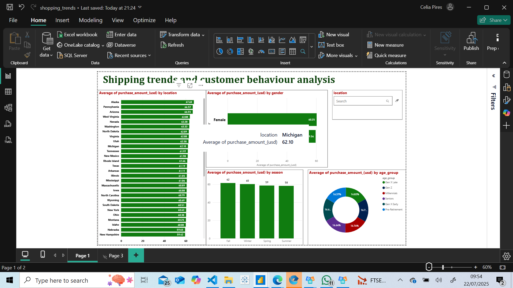
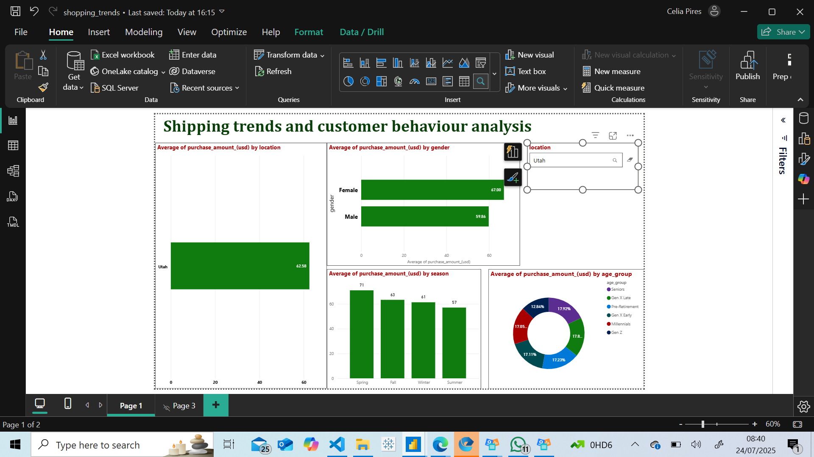

# **Shopping trends and customer behaviour analysis**
## *Celia Pires*

## **Project introduction**

* This dataset provides a detailed snapshot of online shopping behaviour and consumer trends. It contains synthetic yet realistic customer profiles with various features such as age, gender, purchase categories, payment preferences and engagement with promotional offers. 

* The dataset can be found in Kaggle: [dataset](https://www.kaggle.com/datasets/sahilislam007/shopping-trends-and-customer-behaviour-dataset). 

* License: (CC0) Public domain

## Dataset content

* 3900 rows
* 18 columns
* File type: csv

| **Column** | **Description** |
| --------------------------- | --------------------------------------------- |
| **Unnamed column** | Indexed column |
| **Customer ID** | Unique identified for each customer |
| **Age** | Age of the customer |
| **Gender** | Gender of the customer (Male / Female/Other) |
| **Item purchased** | Name of the item bought |
| **Category** | Category of the item (e.g., Clothing, Footwear) |
| **Purchase amount (USD)** | Total amount spent in USD |
| **Location** | Location where the purchase occurred |
| **Color** | Preferred color of the item |
| **Season** | Season in which the purchase was made |
| **Review rating** | Customer review score (scale: 1.0 to 5.0) |
| **Subscription status** | Whether the customer is subscribed to a membership plan (Yes/No) |
| **Shipping type** | Chosen method of shipping (e.g., Express, Free Shipping, Next Day Air) |
| **Discount applied** | Whether a discount was used in the transaction (Yes/No) |
| **Promo code used** | Whether a promo code was applied (Yes/No) |
| **Previous purchases** | Number of past purchases made by the customer |
| **Payment method** | Payment method used (e.g., Credit Card, PayPal, Venmo, Cash) |
| **Frequency of purchases** | Stated frequency of shopping (e.g., Weekly, Monthly, Annually) |

## **Business requirements**

### **Business goals: promotion response**

* Which segments are more likely to respond to promotional events (i.e., use promo codes or discounts)?

* What customer attributes correlate with higher spending during promotions?

## **Promotional response hypotheses and how they will be validated**

| **Hypothesis** | **Test Type** | **Validation**
|-----------------------------------------------------|------------------------------------------------------|------------------------------------------------------|
| H1: **Younger customer groups** (e.g., Gen Z, Millennials) **use promo codes more often than older groups** | Chi-squared test | Promo code usage across age segments |
| H2: **Female customers are more likely to use discounts than male customers** | Chi-squared test | Gender vs discount usage |
| H3: **Customers who use discounts tend to spend more per purchase** | Independent two-sample t-test | Compare purchase amounts (discounted vs not) |
| H4: **Season affects promotion response** (e.g., more promo code use during Winter Sales) | Chi-squared test | Season vs promo code usage |

### **Rationale for test type used**

* The Chi-squared test is used to test associations between two categorical variables. 

* When comparing means (averages) of a numeric variable (purchase_amount_(usd)) between two independent groups (discount_applied = yes or no), the t-test is the statistically correct approach.

### **Summary outcome**

| **Hypothesis** | **What we tested** | **What we found** | **Conclusion** |
|-----------------------------------------------------|------------------------------------------------------|------------------------------------------------------|------------------------------------------------------|
| H1 | **Younger customer groups** (e.g., Gen Z, Millennials) **use promo codes more often than older groups** | Not statistically significant | Not supported  |
| H2 | **Female customers are more likely to use discounts than male customers** | Statistically significant | **Not supported** (pattern in dataset contradicts the hypothesis result) |
| H3 | **Customers who use discounts tend to spend more per purchase** | Not statistically significant | Not supported |
| H4 | **Season affects promotion response** (e.g., more promo code use during Winter Sales) | Not statistically significant | Not supported |

## **Project plan**

* During the ideation and organisation phase, I brainstormed a series of user stories with milestones and deadlines to ensure that the overall deadline for completion was met. I also agreed the data cleanse and transformation strategy.

* This is the high level plan I came-up with:

| **Milestone** | **Task** | **Deadline**
|-----------------------------------------------------|------------------------------------------------------|------------------------------------------------------|
| **Project set-up** | Select project idea | **18/07/25** |
| **Project set-up** | Create github repository | **18/07/25** |
| **Project set-up** | Kanban board set-up | **18/07/25** |
| **Project set-up** | VS Code project set-up | **18/07/25** |
| **ETL** | Data load/preparation | **21/07/25** |
| **Data analysis** | Hypothesis testing | **22/07/25** |
| **Data analysis** | Customer segmentation| **22/07/25** |
| **Data visualisation** | Generate insights | **23/07/25** |
| **Project closure** | Project documentation | **24/07/25** |

* The detail of the project Kanban board can be found here: [Kanban board](https://github.com/users/CeliaPires/projects/9/views/1?visibleFields=%5B%22Title%22%2C%22Assignees%22%2C%22Labels%22%2C%22Milestone%22%5D)

## **The rationale to map the business requirements to the data visualisations**

* placeholder text

## **Analysis techniques used**

* placeholder text

## **Ethical considerations**

* placeholder text

## **Dashboard Design**

* For data visualisation, chose to use Power BI (PBI). Due to limitations with the version of PBI being used, a link cannot be provided. However, a file is available in the **Dashboards** folder labelled **shopping_trends**.

I also provide a web link, in case my "pro" access is still active (part of the 60 days free trial).

[Dashboard web link]().

In PBI, chose 4 visualisations that correlate to the business goals: increase sales through marketing campaigns.

Since hypothesis testing highlighted issues with the quality of the data, changed some of the parameters to produce the visualisations.

For all the visualisations, **changed the parameter for purchase_amount_(usd) from 'sum' to ''average'** to produce insightful insights.

**1. Stacked bar chart: average of purchase_amount_(usd) by location**

This first graph shows the average spend by location. By hoovering over the graph, you will be able to see the values individually. I was interested to see if there were areas were marketing campaigns had proven to be more impactful than others. As you can see, the average spend ranges from $59.42 in New Hampshire (lowest) to $67.60 in Alaska (highest), a difference of only $8.18 which is not significant considering how expensive marketing campaigns are. So here, I would say that the average spend is the same across all regions.

**2. Line and stacked column chart: average of purchase_amount (usd) by season**

Using the line and stacked column chart, I was interested to see if marketing campaigns had had any significant impact on average spend by season (I purposely changed the variable from promo_code_used from hypothesis testing to average_spend_usd). Once again the results show that there are no differences across seasons. It ranges from $58.41 in the summer (lowest) to $61.66 in the fall (highest), a marginal difference of $3.25. As an example, when we know that Black Friday is a big event in the US and companies tend to slash their prices to increase revenue, I was surprised to see no difference across seasons. There are only 3 case scenarios here: either the company did not run any promotional events, or they did run and there was no ROI or the dataset is incorrect. Before jumping to any conclusions, had this been in a real working environment, I would have checked the accuracy of the data first before jumping to any conclusions.

**3. Donut chart: average of purchase_amount (usd) by age group**

The donut chart shows average spend by age group (changed the variable from promo_code_used from hypothesis testing to average_spend_usd). Again, you can see in the graph that there are no differences across customer segments and average spend which is unusual.

**4. Clustered bar chart: average of purchase_amount (usd) by gender**

The clustered bar chart shows average spend by gender. For this one, I chose to change the variable from discount_applied from hypothesis testing to average_spend_usd. Again, there is no difference in average spend across genders (average spend is roughly $60). I had always heard females to be higher spenders compared to males. Again, I would challenge the accuracy of the data when you also take into account the method of payment. If you hoover over the graph, you will see a tooltip I created and added to the graph that shows the method of payment by count of transactions. Again, I see some inconsistencies here. For females, the 3 main methods of payment are: credit card, paypal and cash. For males, cash, debit card and paypal. In Kaggle, the summary of the dataset mentions "**online** shopping behaviour". When shopping online, I struggle to understand how a customer can make payments using cash or even "bank transfer". This additional finding highlights once again that the data might not be correct. 

**5. Text filter based on location**

This last visualisation provides a quick way to view data by filtering on the location. If I type in "Utah" as an example and press "enter" all the graphs automatically update to only show data related to that location. 

## **Unfixed Bugs**

Fortunately, there are no unfixed bugs to report on. This time round, I adopted a different strategy that incorporated lessons learnt from solo and group hackathons along with planning ahead for the capstone. My knowledge and understanding of the process has greatly improved which is rewarding to see. This time round I felt more in control. My checklist definitely helped and also reaching out to my fellow students as and when I was not sure of something was really reassuring. At the start of the project when I was trying to clone my repo in VS Code, I got confused with some of the steps. I reached-out to Natalie Waugh who very kindly provided guidance on what I needed to do. Same thing with Power BI where I felt that my knowledge was not where it needed to be. I reached-out to a couple of people in my cohort who were able to recommend YouTube content to address some of my gaps. Finally, during the capstone when I add to complete clustering for my dataset, reached-out to Spencer to validate my understanding and the interpretation of the results. In the process, realised how important the data cleanse/tranformation step is, more specifically when it comes to data re-engineering. I have definitely learned from it and will be more vigilent as and when I perform a similar type of work in the future.

## **Development roadmap**

Completing the Hackathons and the Capstone project has been a big learning curve for me. As I progressed through the bootcamp, I overcame the imposter syndrome and with it my knowledge and understanding of the process. That being said, there are 2 areas where I plan to develop further. The first one being Power BI. Although I am able to perform basic/simple visualisations, I feel there is more to learn and I have already identified a couple of videos on YouTube to help me with this. The second area is around consolidating my knowledge and understanding of machine learning. For this, I plan to revisit the content in the LMS and practice with datasets from Kaggle so that I can test various techniques and learn what works and what does not work.

## **Main Data Analysis Libraries**

* Pandas & Numpy to convert csv file into a DataFrame to facilitate the data cleansing/transformation process. 

* Scipy for statistical analysis and hypothesis testing.

* Matplotlib, seaborn & plotly for visualisation of the hypotheses.

* Sklearn for customer segmentation.

## **Credits**

**ULTIMATE Power BI tutorial beginner to pro course (2024)**: [pbi tutorial](https://www.youtube.com/watch?v=Dk25lwdTKow&t=10371s).
This YouTube tutorial helped me grasp the basics of PBI to complete the capstone project.

### **Content**

**Code Institute LMS programme** [LMS](https://learn.codeinstitute.net/ci_program/daai_9).
I used the LMS throughout the project to access Python code and overall learning content.

### **Media**

* The image used for the project introduction was taken from Kaggle [Project image intro](https://www.kaggle.com/datasets/sahilislam007/shopping-trends-and-customer-behaviour-dataset).

## **Acknowledgements**

**Jane Weightman** for sharing the breakfix for the Plotly issue.

**Natalie Waugh** for her support and guidance throughout the project.

**Emma Lamont** for her patience and support throughout the course and during the capstone project.

**Vasi** for deputising for Emma and helping me with my queries/issues with the sharing of the PBI desktop dashboard.

